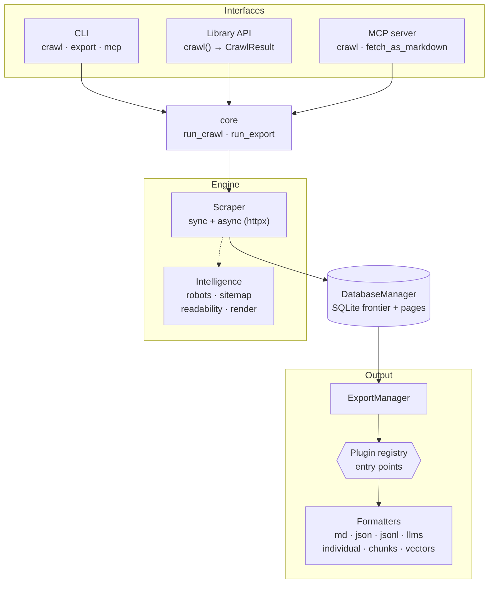

# crawler-to-md 🌐✍️


Crawl websites and turn them into clean Markdown, JSON and LLM-ready datasets —
built to feed GPTs, RAG pipelines and AI agents.

---

## 🏗 Architecture



The pipeline: **interface → core orchestration → Scraper (sync or async) →
SQLite store → ExportManager + pluggable formatters**. Crawl-intelligence
features wrap the fetch/scrape stage; output formats are discovered through an
entry-point plugin registry.

---

## ✨ Features

| Area | Highlights |
|---|---|
| 🕷 **Crawling** | Link-following crawler with SQLite frontier, base-URL filtering, include/exclude URL patterns, rate limiting, delay, proxy (HTTP/SOCKS) |
| 🔁 **Robustness** | Automatic retries with exponential backoff + jitter (429/5xx/`Retry-After`), per-request timeouts, crawl bounds (`--max-pages/--max-depth/--max-time`), content-hash refresh |
| ⚡ **Concurrency** | Async `httpx` engine with bounded parallelism (`--concurrency N`); sync path preserved and verified for parity |
| 🧠 **Intelligence** | `robots.txt` compliance, sitemap seeding, boilerplate extraction (trafilatura), JS rendering (Playwright), custom headers/cookies/auth, non-HTML ingestion (PDF/docx via MarkItDown) |
| 🧩 **HTML shaping** | Include/exclude page elements with CSS-like selectors (`#id`, `.class`, `tag`) before conversion |
| 🤖 **AI-ready output** | Markdown, JSON, JSONL, `llms.txt`/`llms-full.txt`, YAML frontmatter, token-aware RAG chunks, Parquet vectors, end-of-run token accounting |
| 🔌 **Interfaces** | CLI subcommands, embeddable `crawl()` library API, and an MCP server for AI agents |
| 🔧 **Extensible** | Entry-point plugin system for formatters, filters, processors and fetchers |
| 🐳 **Packaging** | Lightweight core, optional extras, multi-arch Docker image |

---

## 📦 Installation

### With Docker (recommended)

```shell
docker run --rm \
  -v "$(pwd)/output:/app/output" \
  -v crawler-cache:/home/app/.cache/crawler-to-md \
  ghcr.io/obeone/crawler-to-md --url https://example.com
```

### With pipx (isolated) or pip

```shell
pipx install crawler-to-md
# or
pip install crawler-to-md
```

```shell
crawler-to-md --url https://example.com
```

Python 3.10+ required.

### Optional extras

Heavy or niche features ship as extras so the core stays lightweight:

| Extra | Install | Enables |
|---|---|---|
| `readability` | `pip install crawler-to-md[readability]` | Boilerplate extraction via trafilatura (`--extract readability`) |
| `render` | `pip install crawler-to-md[render]` | JS rendering via Playwright (`--render`); then `playwright install chromium` |
| `rag` | `pip install crawler-to-md[rag]` | Token-aware RAG chunking (`--chunk-size/--chunk-overlap`) + exact token counts |
| `vector` | `pip install crawler-to-md[vector]` | Parquet vector export (`--export-vectors`) |
| `mcp` | `pip install crawler-to-md[mcp]` | MCP server (`crawler-to-md mcp`) |
| `dev` | `pip install crawler-to-md[dev]` | pytest, ruff, pytest-cov |

Extras combine: `pip install "crawler-to-md[rag,vector,mcp]"`.

---

## ⚙️ Configuration

Drop a `crawler-to-md.toml` in your working directory (auto-discovered, or pass
`--config path.toml`). CLI flags always override file values.

```toml
# crawler-to-md.toml
url = "https://docs.example.com"
output-folder = "./docs-export"
concurrency = 4
max-pages = 200
export-llms = true
chunk-size = 512
chunk-overlap = 64
```

Logging verbosity is controlled by the `LOG_LEVEL` environment variable
(default `WARN`):

```shell
LOG_LEVEL=INFO crawler-to-md --url https://example.com
```

---

## 🛠 Usage

crawler-to-md uses subcommands. The legacy `crawler-to-md --url ...` invocation
is fully preserved — with no subcommand it defaults to `crawl`.

| Command | Purpose |
|---|---|
| `crawler-to-md crawl --url <URL> [options]` | Crawl a site and export (default) |
| `crawler-to-md export --url <URL> [options]` | Re-export from an existing cache, no re-crawl |
| `crawler-to-md mcp` | Start the MCP server over stdio |

### `crawl` options

**Input / output**

| Flag | Description |
|---|---|
| `--url`, `-u` | Starting URL |
| `--urls-file` | File of URLs (one per line); `-` reads stdin |
| `--output-folder`, `-o` | Output directory (default `./output`) |
| `--cache-folder`, `-c` | SQLite cache dir (default `~/.cache/crawler-to-md`) |
| `--base-url`, `-b` | Restrict links to this base (default: URL's base) |
| `--title`, `-t` | Output title (default: the URL) |
| `--config` | Path to a `crawler-to-md.toml` (auto-discovered in CWD) |

**Crawl control**

| Flag | Description |
|---|---|
| `--overwrite-cache`, `-w` | Drop the cache DB before scraping |
| `--exclude-url`, `-e` | Skip URLs containing this string (repeatable) |
| `--include-url`, `-I` | Keep only URLs containing this string (repeatable) |
| `--rate-limit`, `-rl` | Max requests/minute (`0` = no limit) |
| `--delay`, `-d` | Delay between requests, seconds |
| `--proxy`, `-p` | HTTP or SOCKS proxy URL |

**HTML filtering**

| Flag | Description |
|---|---|
| `--include`, `-i` | CSS-like selector to keep before conversion (repeatable) |
| `--exclude`, `-x` | CSS-like selector to drop before conversion (repeatable) |

**Robustness**

| Flag | Description |
|---|---|
| `--timeout` | Per-request timeout, seconds (default `15`) |
| `--max-retries` | Retries on transient failures (default `3`) |
| `--max-pages` | Stop after N pages (`0` = unlimited) |
| `--max-depth` | Max link-discovery depth (`-1` = unlimited) |
| `--max-time` | Max wall-clock time, seconds (`0` = unlimited) |

**Concurrency**

| Flag | Description |
|---|---|
| `--concurrency N` | `1` = sync engine (default); `N>1` = async `httpx` with a bounded semaphore (politeness preserved) |

**Intelligence**

| Flag | Description |
|---|---|
| `--ignore-robots` | Disable robots.txt (honored by default) |
| `--user-agent` | Custom User-Agent on every request |
| `--sitemap` | Seed the frontier from the host's `/sitemap.xml` |
| `--extract {none,readability}` | Content extraction; `readability` needs `[readability]` |
| `--render` | Fetch JS-rendered HTML; needs `[render]` + `playwright install chromium` |
| `--header "K: V"` | Extra request header (repeatable) |
| `--cookie "k=v"` | Request cookie (repeatable) |
| `--auth user:pass` | HTTP Basic auth |
| `--allow-types <mime>` | Extra MIME types to ingest via MarkItDown, e.g. `application/pdf` (repeatable) |

**Output formats**

| Flag | Description |
|---|---|
| `--export-individual`, `-ei` | One Markdown file per page |
| `--frontmatter` / `--no-frontmatter` | YAML frontmatter on individual files (on by default) |
| `--no-markdown` | Skip the compiled Markdown file |
| `--no-json` | Skip the compiled JSON file |
| `--export-jsonl` | JSON Lines, one `{url, content, metadata}` per line |
| `--export-llms` | `llms.txt` (index) + `llms-full.txt` (full content) |
| `--chunk-size N` | RAG chunks of N tokens (`0` = off); needs `[rag]` |
| `--chunk-overlap N` | Token overlap between chunks |
| `--export-vectors` | Parquet export for vector indexing; needs `[vector]` |

Every run prints a summary (links discovered, pages scraped/stored, bytes,
tokens, duration). Token counts are exact with the `rag` extra, estimated
otherwise.

### `export` — re-export without re-crawling

```shell
crawler-to-md export --url https://docs.example.com \
  --export-llms --export-jsonl --chunk-size 512 --chunk-overlap 64
```

### `mcp` — Model Context Protocol server

```shell
pip install "crawler-to-md[mcp]"
crawler-to-md mcp        # serves over stdio
```

Exposes the tools `crawl` and `fetch_as_markdown` to MCP-speaking agents and
orchestrators. See **[docs/mcp.md](docs/mcp.md)**.

---

## 📚 Library API

`crawler_to_md` is embeddable — no CLI side effects, no `sys.argv` parsing.

```python
from crawler_to_md import crawl

result = crawl("https://docs.example.com", max_pages=50, concurrency=4)

for page in result.pages:
    print(page["url"], len(page["content"]))

print(f"{result.stats.pages_scraped} pages in {result.stats.duration:.1f}s")
```

`crawl()` returns a `CrawlResult` (`pages`, `stats`, `exports`). Full reference:
**[docs/library.md](docs/library.md)**.

---

## 🔧 Plugin system

An entry-point plugin architecture covers all four pipeline stages. Built-in
output formats ship as first-party formatters wired live through the registry.

| Stage | Entry-point group | Protocol method |
|---|---|---|
| Formatter | `crawler_to_md.formatters` | `export(manager, output_path, **options)` |
| Filter | `crawler_to_md.filters` | `is_allowed(url) -> bool` |
| Processor | `crawler_to_md.processors` | `process(html, url) -> str` |
| Fetcher | `crawler_to_md.fetchers` | `fetch(url)` |

Register your own in your package's `pyproject.toml`:

```toml
[project.entry-points."crawler_to_md.formatters"]
my-format = "my_package.exporters:MyFormatter"
```

Full guide: **[docs/plugins.md](docs/plugins.md)**.

---

## 🐳 Docker

```shell
# Run the published image
docker run --rm \
  -v "$(pwd)/output:/app/output" \
  -v crawler-cache:/home/app/.cache/crawler-to-md \
  ghcr.io/obeone/crawler-to-md --url https://example.com

# Build from source
docker build -t crawler-to-md .
docker run --rm -v "$(pwd)/output:/app/output" crawler-to-md --url https://example.com
```

---

## 🧪 Development

```shell
uv pip install -e ".[dev]"   # editable install with dev tools
uv run --extra dev pytest    # run the test suite
uv run --extra dev ruff check .   # lint
```

See **[docs/](docs/)** for deeper guides (configuration, library, MCP, plugins).

---

## ⚠️ Known limitations

- The **filter/processor/fetcher** plugin protocols are defined and tested but
  not yet consumed by the crawl loop (formatters are live); integration is
  planned.
- **Sitemap parsing** uses the stdlib `xml.etree.ElementTree`. For untrusted
  sitemaps, consider `defusedxml` to guard against XML-expansion DoS.

---

## 🤝 Contributing

Issues and pull requests are welcome. Run the test suite and `ruff` before
submitting.

## 📝 License

[MIT](LICENSE) © Grégoire Compagnon ([obeone](https://github.com/obeone))
